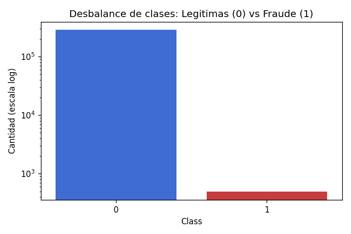
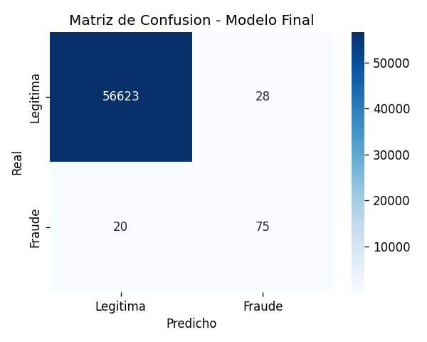
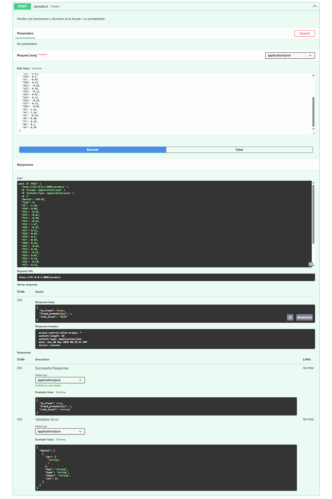
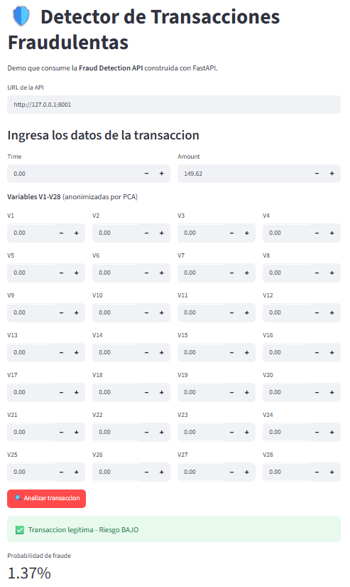
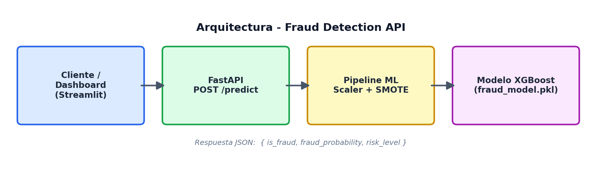

# 🛡️ Fraud Detection API

> API REST que clasifica transacciones bancarias fraudulentas en tiempo real.
> Modelo de Machine Learning servido con FastAPI y desplegado en produccion.

**[🚀 Demo en vivo](https://fraud-detector-api-80h1.onrender.com/docs)** · **[📓 Notebook de analisis](notebooks/01_eda_modeling.ipynb)**


> ⏳ La demo puede tardar ~30-50 segundos en cargar la primera vez, ya que el plan gratuito de Render suspende el servicio tras periodos de inactividad.

---

## 🎯 El problema de negocio

Solo el **0.17%** de las transacciones son fraude. Un modelo que prediga
"todo es legitimo" tendria 99.8% de *accuracy*... y seria **completamente inutil**.

Por eso este proyecto **no optimiza accuracy**, sino **Recall** y **PR-AUC**:
el costo de dejar pasar un fraude es mucho mayor que el de revisar una
transaccion legitima por error.



## 📊 Resultados

Compare tres modelos aplicando **SMOTE** para manejar el desbalance.
Las metricas corresponden a la **clase fraude** (la que importa):

| Modelo              | Precision | Recall | F1    | ROC-AUC | PR-AUC |
|---------------------|-----------|--------|-------|---------|--------|
| Logistic Regression | 0.053     | 0.874  | 0.100 | 0.963   | 0.675  |
| Random Forest       | 0.910     | 0.747  | 0.821 | 0.973   | 0.815  |
| **XGBoost (final)** | **0.728** | **0.789** | **0.758** | **0.970** | **0.808** |

> **Lectura de negocio:** la Regresion Logistica atrapa muchos fraudes (recall 0.87)
> pero genera 95% de falsas alarmas (precision 0.05), inservible en produccion.
> **Random Forest y XGBoost** ofrecen el mejor equilibrio. Se eligio **XGBoost** por
> su mayor *recall* (0.79): en deteccion de fraude, dejar pasar un fraude suele
> costar mas que revisar una transaccion legitima de mas.

El modelo final detecta **75 de 95 fraudes** en el conjunto de prueba,
con solo **28 falsas alarmas** entre 56,651 transacciones legitimas:



## 🖥️ La API en acción

Documentación interactiva (Swagger) generada automáticamente por FastAPI.
El endpoint `POST /predict` recibe una transacción y devuelve la predicción en tiempo real:



## 📲 Dashboard interactivo

Frontend en Streamlit que consume la API y permite analizar transacciones
de forma visual, mostrando la probabilidad de fraude y el nivel de riesgo:



## 🏗️ Arquitectura



## 🧰 Stack tecnologico

`Python` · `Pandas` · `Scikit-Learn` · `XGBoost` · `imbalanced-learn` · `FastAPI` · `Streamlit` · `Pytest` · `Render`

## 🚀 Como ejecutar localmente

```bash
git clone https://github.com/danteprogrammer/fraud-detector.git
cd fraud-detector
python -m venv venv
venv\Scripts\activate         # Windows
pip install -r requirements.txt
uvicorn api.main:app --reload
```

Abre `http://127.0.0.1:8000/docs` para la documentacion interactiva.

## 🧪 Tests

```bash
pytest -v
```

## 📁 Estructura

```
fraud-detector/
├── api/          # FastAPI
├── src/          # Schemas y validacion
├── models/       # Modelo entrenado + graficos
├── notebooks/    # EDA y entrenamiento
├── dashboard/    # Frontend en Streamlit
└── tests/        # Pruebas automatizadas
```

## 👤 Autor

**Rodrigo Alonso Quezada Ccahuana** — Estudiante de Ingenieria de Sistemas
[GitHub](https://github.com/danteprogrammer)
